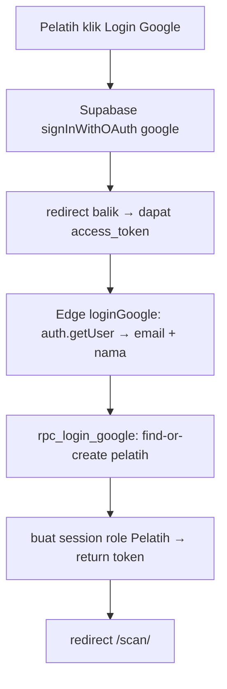

# PRD — Login Pelatih via Google (Supabase Auth)

## 1. Latar belakang & tujuan

- Sekarang login hanya untuk **admin** (username + password custom, tabel `admin`).
- Pelatih tidak punya akun login — pelatih selama ini cuma **data yang di-scan**
  (tabel `pelatih`: barcode + nama), bukan pengguna.
- Tujuan sekarang: **pelatih login pakai Google**, lalu boleh **scan presensi
  siswa** (bukan scan pelatih).
- Model **hybrid**: auth admin (custom) tetap, pelatih lewat **Supabase Auth
  (Google OAuth)**. Tidak pakai Firebase.

## 2. Ruang lingkup

**Masuk (sekarang):**

- Pelatih login via Google OAuth (Supabase Auth).
- Auto-provisioning: login Google pertama → baris `pelatih` dibuat otomatis
  (barcode `PLT-xxxx` + `nama` dari Google).
- Role gate: pelatih hanya boleh `scanPresensi` (scan siswa), TIDAK boleh
  `scanPresensiPelatih` & TIDAK boleh aksi admin.
- Admin tetap login custom, akses semua (tidak berubah).
- Hapus pelatih lama (buatan manual admin) — tidak dipakai lagi.

**Keluar (sekarang):**

- Migrasi admin ke Supabase Auth (admin tetap custom).
- Audit "siapa yang scan" (`dicatat_oleh` di `presensi`).
- Firebase Auth (tidak dipakai).

## 3. Aktor

| Aktor | Auth | Akses |
|---|---|---|
| Admin/Pengurus | custom username+password | semua aksi |
| Pelatih | Google OAuth | scan siswa saja |
| Publik (tanpa login) | — | dashboard + daftar siswa (sudah ada, tidak berubah) |

## 4. Kebutuhan fungsional (FR)

| ID | Kebutuhan |
|---|---|
| FR-1 | Pelatih klik "Login dengan Google" di `/login/` → redirect OAuth Google |
| FR-2 | Login Google sukses → cari `pelatih` by `auth_uid`; kalau belum ada, buat baris baru (barcode auto, `nama` = nama Google) |
| FR-3 | Pelatih login → dapat token sesi custom (tabel `sessions`, role `Pelatih`) |
| FR-4 | Pelatih hanya boleh `scanPresensi` (scan siswa); `scanPresensiPelatih` ditolak |
| FR-5 | Pelatih TIDAK boleh aksi admin (CRUD siswa/pelatih, iuran, cetak, rekap) |
| FR-6 | Admin (custom) tetap akses semua, termasuk `scanPresensiPelatih` |
| FR-7 | Redirect setelah login: pelatih → `/scan/`, admin → `/dashboard/` |
| FR-8 | Nav/menu admin disembunyikan untuk role pelatih |
| FR-9 | Pelatih lama (buatan manual) bisa dihapus admin; data siswa TIDAK boleh disentuh |
| FR-10 | `ip_max_login_attempts` dinaikkan (10 → 30) untuk akomodasi pelatih se-IP |

## 5. Kebutuhan non-fungsional (NFR)

- **Free tier**: Supabase Auth 50.000 MAU — pelatih ±20 = jauh di bawah. Tidak
  ada komponen berbayar.
- **Aditif, bukan destruktif**: perubahan hanya `ALTER TABLE ... ADD COLUMN` di
  `pelatih` + fungsi baru. Tabel `siswa`, `presensi`, `iuran`, `jadwal`,
  `admin`, `sessions` TIDAK disentuh/di-drop.
- **Custom session tetap**: `sessions` + `rpc_verify_token` tidak berubah.
  Edge Function tetap `--no-verify-jwt` + service_role.
- Pola lama dipertahankan: `rpc_*` di Postgres, Edge Function cuma router,
  RLS tertutup.

## 6. Desain data

### Perubahan `pelatih` (ADITIF)

`pelatih.barcode` tetap primary key (kunci scan QR). Tambah 2 kolom untuk
identitas Google:

```sql
alter table pelatih
  add column if not exists auth_uid text,
  add column if not exists email    text;

-- partial unique: baris lama (NULL) tidak konflik
create unique index if not exists idx_pelatih_auth_uid
  on pelatih (auth_uid) where auth_uid is not null;
create unique index if not exists idx_pelatih_email_lower
  on pelatih (lower(email)) where email is not null;
```

- `auth_uid` = `auth.users.id` (UUID Supabase, kunci match login berikutnya).
- `email` = email Google.
- `nama` = display name Google (tidak input manual).
- `barcode` = auto `PLT-xxxx` (pakai `next_barcode_pelatih()` yang sudah ada).

### Tidak berubah

- `admin`, `sessions`, `login_attempts`, `login_attempts_ip` — auth custom admin.
- `siswa`, `presensi`, `jadwal`, `iuran`, `presensi_pelatih` — utuh.

### app_config()

`app_config()` didefinisikan ulang di beberapa file delta dengan key set beda.
Delta ini harus **merge seluruh key terkini + `ip_max_login_attempts` = 30**,
atau langsung ubah di `pelatih.sql`. Kalau tidak, re-run file lama menghapus
key baru (gotcha sama seperti PRD-presensipelatih §6).

## 7. API / RPC baru

| Fungsi / action | Aksi | Catatan |
|---|---|---|
| `rpc_login_google(p_auth_uid, p_email, p_nama)` | find-or-create pelatih + buat session role `Pelatih` | mirror `rpc_login`, return `{token, nama, role}` |
| Edge `loginGoogle` | verifikasi Supabase access_token → panggil `rpc_login_google` | |

Edge Function `loginGoogle`:
1. Terima `access_token` Supabase dari client.
2. `auth.getUser(access_token)` → `{ id, email, user_metadata.full_name }`.
3. Panggil `rpc_login_google(p_auth_uid=id, p_email=email, p_nama=full_name)`.
4. Return token sesi custom.

`rpc_verify_token` **tidak berubah** — pelatih & admin sama-sama pakai tabel
`sessions`; `username` untuk pelatih = email.

### Role gate (Edge Function)

Tambah whitelist deny-by-default:

```ts
const PELATIH_ACTIONS = new Set([
  "scanPresensi",
  "getPresensiList",
  "getPresensiPelatihList", // read-only, untuk panel "Presensi Hari Ini"
  "getSiswaList", "getKelompokList", "getPelatihList", "getDashboardStats",
]);
// setelah verify token:
if (session?.role === "Pelatih" && !PELATIH_ACTIONS.has(action)) {
  return jsonError(req, "Aksi tidak diizinkan.", "FORBIDDEN");
}
```

Kontrak `{ action, token, payload }` → `{ ok, data }` tidak berubah.

## 8. Frontend & alur

| File | Perubahan |
|---|---|
| `login/index.html` + `login.js` | tambah tombol "Login dengan Google" |
| `assets/js/core/auth.js` | tambah `loginGoogle()` (pakai supabase-js `signInWithOAuth`) + simpan session custom role Pelatih |
| `assets/js/core/ui.js` | `renderShell` filter nav by role (sembunyikan menu admin untuk Pelatih) |
| `assets/js/pages/scan.js` | opsional: sembunyikan scan pelatih untuk role Pelatih (backend tetap memblok) |
| `assets/js/vendor/` | bundle `@supabase/supabase-js` lokal (ikut pola no-CDN) |

Alur login pelatih:



## 9. Aturan bisnis (role)

- Pelatih = `scanPresensi` saja. Prefix `PLT-` yang di-scan pelatih → ditolak
  backend (FORBIDDEN).
- Admin = semua aksi (tidak berubah), termasuk scan pelatih & rekap.
- 1 pelatih 1× per hari tetap berlaku (constraint `unique(pelatih_barcode, tanggal)`).
- Pelatih nonaktif (`status = 'Nonaktif'`) → login Google tetap membuat/‌mengambil
  baris, tapi scan siswa ditolak? → **putuskan**: scan siswa TIDAK terkait status
  pelatih (pelatih scan siswa, bukan scan dirinya). Status `pelatih` hanya
  memengaruhi scan presensi pelatih, bukan hak login pelatih.
  `ponytail:` kalau nanti perlu blokir pelatih login, tambah cek `status` di
  `rpc_login_google`. Tidak sekarang.

## 10. Optimasi free tier

- Pelatih login = 1 invoke `loginGoogle` + 1 RPC. Scan siswa = 1 invoke
  `scanPresensi` (sama seperti admin). Tidak ada endpoint baru yang boros.
- `auth.users` (Supabase Auth) tumbuh 1 baris per pelatih — diabaikan.
- Data `pelatih` ±20 baris tetap. Satu-satunya pertumbuhan = `presensi`
  (±1.300 baris/bulan, sudah dioptimasi pagination + index + agregasi DB).

## 11. Migrasi & batasan keamanan data

**HARD CONSTRAINT — jangan dilanggar:**
- Tabel `siswa` dan `presensi` (presensi siswa) TIDAK boleh di-DROP/TRUNCATE/
  DELETE/ubah. Semua SQL delta ini hanya menyentuh `pelatih` + auth.

**Pelatih lama:**
- Pelatih buatan manual admin tidak dipakai lagi → boleh dihapus admin lewat
  halaman `pelatih/` yang sudah ada.
- `presensi_pelatih.pelatih_barcode` `on delete set null` → riwayat tidak rusak.
- Tidak perlu strategi match-email: pelatih baru fresh lewat Google.

## 12. Langkah deploy

1. **Manual (di sisi pengguna)**: buat OAuth Client ID di Google Cloud Console
   (consent screen + redirect URI), gratis.
2. Supabase dashboard → Auth → Providers → Google: tempel Client ID + Secret.
3. Jalankan SQL delta (aditif) — `pelatih` + 2 kolom + `rpc_login_google` +
   `app_config()` merge (`ip_max_login_attempts` = 30).
4. Deploy Edge Function (tambah `loginGoogle` + role gate; tetap `--no-verify-jwt`).
5. Frontend: bundle supabase-js, tambah tombol login Google, `auth.loginGoogle`,
   nav by role, redirect by role.
6. Deploy GitHub Pages.
7. Uji: pelatih login Google → auto buat baris `pelatih` → scan siswa OK →
   scan pelatih ditolak.

## 13. Kriteria terima

- Pelatih login Google → masuk, nama tampil dari Google.
- Login Google pertama → baris `pelatih` baru (barcode `PLT-xxxx`) muncul di
  halaman `pelatih/` & bisa dicetak QR.
- Pelatih scan siswa → "Hadir/Telat" tercatat normal.
- Pelatih scan kode `PLT-*` → ditolak (FORBIDDEN).
- Pelatih akses aksi admin (hapus siswa, iuran, dst.) → ditolak.
- Admin login custom tetap jalan, akses semua (termasuk scan pelatih).
- Data siswa & riwayat presensi siswa utuh, tidak ada yang terhapus.
